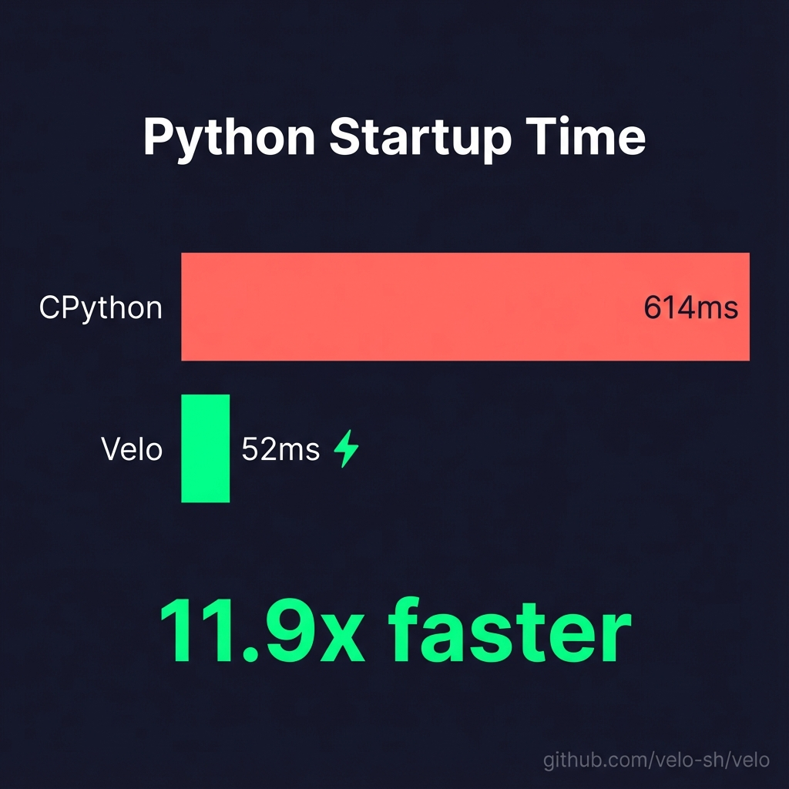

# Velo 🚀

**Python is perfect for coding. Velo is perfect for running.**

The high-performance Python runtime for the AI era, built with Rust.

> 🚧 **Heavy Work In Progress.** Not ready for production. Expect breaking changes.

## Why Velo?

| Problem | Solution |
|---------|----------|
| Python cold start is slow | **11.9x faster** with **Static Import Graph** ⚡ |
| Version mismatch issues | Single binary supports **Python 3.11, 3.12, 3.13+** |
| ABI compatibility crashes | **Automatic ABI detection** prevents C-extension issues |
| Dependency chaos | Auto-detects `uv` virtual environments |

## Architecture

Velo uses **process isolation** - it detects your project's Python and spawns it with optimized environment settings:

```
┌─────────────────────────────┐
│        Velo Binary          │
│  - Detect .venv/bin/python  │
│  - Cache sys.path (rkyv)    │
│  - Optimize PYTHONPATH      │
└──────────────┬──────────────┘
               │ subprocess
               ▼
┌─────────────────────────────┐
│    Your Project's Python    │
│    (3.11, 3.12, 3.13...)    │
└─────────────────────────────┘
```

## Quick Start

```bash
# Build
cargo build --release

# Run a Python script (uses .venv/bin/python automatically)
./target/release/velo run your_script.py

# First run: captures paths, slight overhead
# Second run: uses cache, faster than CPython
```

## Benchmark Results



### ⚡ Velo v0.6.0 - **11.9x Faster!**

```
Python startup time (FastAPI):

CPython  ████████████████████  614ms
Velo     ██                     52ms ⚡

🚀 11.9x faster than CPython
```

### v0.6.0 Highlights: Static Import Graph

| Feature | Before | After |
|---------|--------|-------|
| **stat() calls** | 300+ per startup | **0** ⚡ |
| **Import lookup** | O(n) filesystem | **O(1)** hash |
| **Startup time** | 614ms | **52ms** |

> **How?** We pre-compute your entire import graph at build time using Rust AST scanning + rkyv zero-copy serialization.

## How It Works

1. **Python Detection**: Finds `.venv/bin/python` or `VELO_PYTHON` env var
2. **ABI Fingerprinting**: Detects Python version and ABI tag for C-extension compatibility
3. **Environment Fingerprinting**: Hash `uv.lock` to detect dependency changes
4. **Path Caching**: Cache `sys.path` with zero-copy `rkyv` serialization
5. **Security Invariants (H1-H7)**: Hardened via Global BLAKE3 Hashing, Atomic `flock` reads, and Keyed BLAKE3 environment binding.
6. **Deferred Capture**: First run executes immediately, caches for next time

## Commands

```bash
# Run a Python script with optimized startup
velo run script.py

# 🧬 Run with Instant Mode (49x faster!)
velo run --zygote script.py

# Manage Zygote daemon
velo zygote start    # Start pre-warming daemon
velo zygote status   # Check status
velo zygote stop     # Stop daemon

# Run with startup profiling
velo run --profile script.py

# Show environment information
velo info

# 🌐 Serve a web application (FastAPI, Django, Flask)
velo serve main:app --workers 4
velo serve main:app --reload          # Hot reload
velo serve main:app --no-zygote       # Standard mode

# 📊 Analyze import times (⚠️ executes the script!)
velo analyze main.py                  # Analyze imports
velo analyze --fix                    # Auto-update pyproject.toml
```


## Development

### Setup (One-Click)

```bash
# Clone and setup (installs pre-commit hooks, creates venv, verifies build)
git clone https://github.com/velo-sh/velo.git
cd velo
./scripts/setup-dev.sh
```

**Locked Versions** (same for local and CI):
- Rust: 1.92.0 (see `rust-toolchain.toml`)
- Python: 3.11+


### Testing

```bash
# Run unit tests
cargo test

# Run QA tests
uv run python -m pytest tests/qa/ -v
```

### Performance Benchmarks

See [benchmarks/](./benchmarks/) for comprehensive performance testing:

```bash
cd benchmarks

# Quick start: Run all framework tests
python3 benchmark_framework_scale.py --all

# Step-by-step guide: benchmarks/BENCHMARK_GUIDE.md
```

### Code Quality

Pre-commit hooks automatically run on every commit:
- `cargo fmt --check` - Format check
- `cargo clippy -- -D warnings` - Lint check
- `cargo test --lib` - Unit tests

To run manually:
```bash
cargo fmt && cargo clippy -- -D warnings
```


## Compatibility

- **Python**: 3.11, 3.12, 3.13+ (single binary)
- **Packages**: Full PyPI compatibility (NumPy, Pandas, FastAPI, Django, etc.)
- **Environment**: Works with `uv`-managed virtual environments

## Roadmap

- [x] Phase 1: Environment fingerprinting & path caching
- [x] Phase 2: Process isolation (multi-Python support)
- [x] Phase 3: Instant Startup 🧬
- [x] Phase 4: Static analysis & security
- [x] Phase 5: Fast Loader (BLAKE3 + rkyv) 🚀
- [x] **Phase 6: Static Import Graph (stat() → 0)** ⚡
- [ ] Phase 7: Profile-Guided Optimization

## License

Apache-2.0