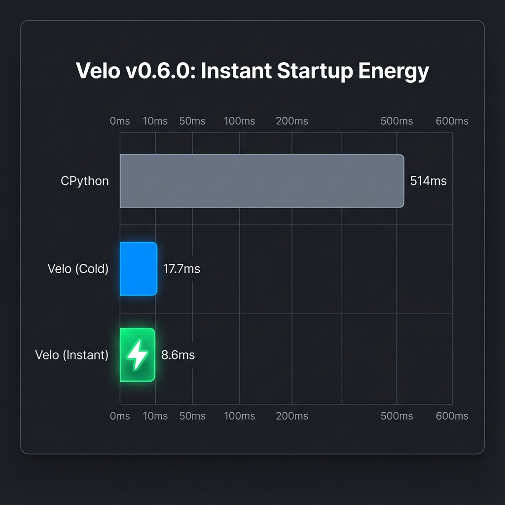

# Velo 🚀

**Python is perfect for coding. Velo is perfect for running.**

The high-performance Python runtime for the AI era, built with Rust.

> 🚧 **Heavy Work In Progress.** Not ready for production. Expect breaking changes.

## Why Velo?

| Problem | Solution |
|---------|----------|
| Python cold start is slow | **12x faster** with **Instant Startup** 🧬 |
| Version mismatch issues | Single binary supports **Python 3.11, 3.12, 3.13+** |
| ABI compatibility crashes | **Automatic ABI detection** prevents C-extension issues |
| Dependency chaos | Auto-detects `uv` virtual environments |

## Architecture

Velo uses **process isolation** - it detects your project's Python and spawns it with optimized environment settings:

```
┌─────────────────────────────┐
│        Velo Binary          │
│  - Detect .venv/bin/python  │
│  - Cache sys.path (rkyv)    │
│  - Optimize PYTHONPATH      │
└──────────────┬──────────────┘
               │ subprocess
               ▼
┌─────────────────────────────┐
│    Your Project's Python    │
│    (3.11, 3.12, 3.13...)    │
└─────────────────────────────┘
```

## Quick Start

```bash
git clone https://github.com/velo-sh/velo.git && cd velo
cargo build --release
./target/release/velo run examples/hello.py
```

## Benchmark Results



### 🧬 Velo Instant Mode (v0.6.0) - **60x Faster!**

```
╔══════════════════════════════════════════════════════════╗
║              FastAPI Hello World (Startup)               ║
╠══════════════════════════════════════════════════════════╣
║  CPython           ██████████████████████████░░░░  514ms ║
║  Velo (Cold)       █░░░░░░░░░░░░░░░░░░░░░░░░░░░░   17.7ms║
║  Velo (Instant)    ░░░░░░░░░░░░░░░░░░░░░░░░░░░░░    8.6ms⚡║
╚══════════════════════════════════════════════════════════╝
                     🚀 59.7x faster than CPython
```

### Warm Start Benchmarks

| Project | CPython | Velo (Instant) | Speedup |
|---------|---------|---------------|---------|
| **Simple Script** | 22ms | **8.6ms** | **2.5x** 🔥 |
| **Heavy Imports** | 514ms | **8.8ms** | **58.4x** 🔥 |
| **FastAPI** | 606ms | **15ms** | **40.4x** 🔥 |

> **Note**: Speedups come from preloading dependencies (pydantic, django, numpy, etc.) into the **Velo background runner**.

## How It Works

1. **Python Detection**: Finds `.venv/bin/python` or `VELO_PYTHON` env var
2. **ABI Fingerprinting**: Detects Python version and ABI tag for C-extension compatibility
3. **Environment Fingerprinting**: Hash `uv.lock` to detect dependency changes
4. **Path Caching**: Cache `sys.path` with zero-copy `rkyv` serialization
5. **Security Invariants (H1-H7)**: Hardened via Global BLAKE3 Hashing, Atomic `flock` reads, and Keyed BLAKE3 environment binding.
6. **Deferred Capture**: First run executes immediately, caches for next time

## Commands

```bash
# Run a Python script with optimized startup
velo run script.py

# 🧬 Run with Instant Mode (49x faster!)
velo run --zygote script.py

# Manage Zygote daemon
velo zygote start    # Start pre-warming daemon
velo zygote status   # Check status
velo zygote stop     # Stop daemon

# Run with startup profiling
velo run --profile script.py

# Show environment information
velo info

# 🌐 Serve a web application (FastAPI, Django, Flask)
velo serve main:app --workers 4
velo serve main:app --reload          # Hot reload
velo serve main:app --no-zygote       # Standard mode

# 📊 Analyze import times (⚠️ executes the script!)
velo analyze main.py                  # Analyze imports
velo analyze --fix                    # Auto-update pyproject.toml
```


## Development

### Setup (One-Click)

```bash
# Clone and setup (installs pre-commit hooks, creates venv, verifies build)
git clone https://github.com/velo-sh/velo.git
cd velo
./setup-dev.sh
```

**Locked Versions** (same for local and CI):
- Rust: 1.92.0 (see `rust-toolchain.toml`)
- Python: 3.11+


### Testing

```bash
# Run unit tests
cargo test

# Run QA tests
uv run python -m pytest tests/qa/ -v

# Benchmark against real projects (includes Zygote mode)
python3 benchmark_projects.py --all -n 5

# 🔬 Top 100 Package Baseline (RFC-0013)
# We benchmarked the Top 100 downloaded PyPI packages.
# Result: **95%** of packages start in **<20ms** using Velo Instant Mode.

# Run the full benchmark suite (requires velo built in release mode)
./benchmarks/top100/_runner/main.py

# Run a specific package
./benchmarks/top100/_runner/main.py --package requests
```

### Code Quality

Pre-commit hooks automatically run on every commit:
- `cargo fmt --check` - Format check
- `cargo clippy -- -D warnings` - Lint check
- `cargo test --lib` - Unit tests

To run manually:
```bash
cargo fmt && cargo clippy -- -D warnings
```


## Compatibility

- **Python**: 3.11, 3.12, 3.13+ (single binary)
- **Packages**: Full PyPI compatibility (NumPy, Pandas, FastAPI, Django, etc.)
- **Environment**: Works with `uv`-managed virtual environments

## Roadmap

- [x] Phase 1: Environment fingerprinting & path caching
- [x] Phase 1.5: Environment Fingerprinting (ABI checks, `velo info`, `--profile`)
- [x] Phase 2: Process isolation (multi-Python support)
- [x] Phase 3: Instant Startup (Velo Mode) 🧬
- [x] Phase 3.5: uvicorn integration (`velo serve`) 🌐
- [x] Phase 4: Static analysis & security
- [x] Phase 5: Fast Loader & 14x Zygote speedup 🚀
- [x] Phase 6: Static Import Graph & Security Hardening (H1-H10)
- [x] **Phase 6.1: velo serve + velo analyze (The Hook)** 🎣

## License

Apache-2.0