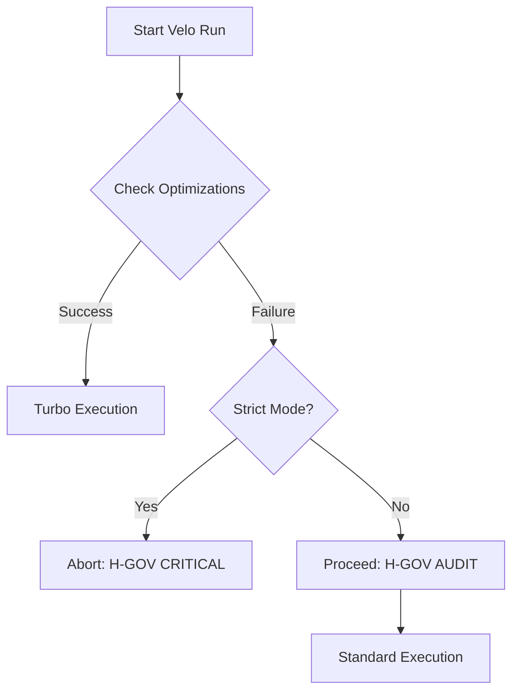

# SOP-004: Fallback Governance (H-Gov) Standard

**Ownership**: Architect Force (ID-LOCK-001)
**Version**: 1.1 (2026-01-10)
**Scope**: Optimization Fallback and Reliability Governance
**Status**: ACTIVE

---

## 1. Governance Identity (TITANIUM Standard)

This document is a specialized extension of [SOP-001: Master Architecture Lifecycle](./SOP-001-master-lifecycle.md). It governs the **Surgical Shielding** of architectural optimizations.

> [!IMPORTANT]
> **Ritual 70 (H-Gov Audit)**: Every optimization path must have a deterministic fallback. Silent failure is an architectural "Sin" (Trap 272).

---

## 2. Core Objective (Design Intent)
In Velo's high-performance architecture, the failure of optimization paths (e.g., Memory Gravity, Zygote, NUMA) often results in "silent performance degradation." This SOP establishes a **deterministic governance mechanism** to ensure:

1.  **Safety First**: Production environments must never crash due to optimization failures.
2.  **Dev Agility**: Any performance regression in CI/Dev must trigger a **Fail-Fast** event.
3.  **Observability**: Every degradation event must generate a standardized **Surgical Audit Signal**.

---

## 3. Governance Matrix

The behavior of the H-Gov system is governed by the `strict_optimizations` flag, which is context-aware based on the `VELO_ENV` environment variable.

| Environment (`VELO_ENV`) | `strict_optimizations` | Behavior | Signal Level | Typical Scenario |
| :--- | :--- | :--- | :--- | :--- |
| **Dev / CI** | **Enabled (`true`)** | **Fail-Fast**: Immediate `bail!()` or exit | `CRITICAL` | Bug discovery, CI regression blocking |
| **Prod** | **Disabled (`false`)** | **Graceful**: Audit Log + Fallback | `AUDIT/WARN` | Production stability, Legacy mode |

### Reference Implementation
- [constants.toml](../config/constants.toml#L22): Default SSOT value.
- [src/config.rs](../src/config.rs#L31): `VeloConfig` field definition.
- [src/config.rs](../src/config.rs#L89-L92): Logic for automatic `prod` relaxation.

---

## 4. Detailed Design Logic

### 4.1 Interception Hooks
Critical paths must implement the following logic at optimization checkpoints:

---

## 5. Structured Audit Signals (Ritual 70.1)

All fallbacks must utilize the `GovernanceSignal` structure to ensure machine-readable and human-actionable logs as per our **Forensic Standard**.

### 5.1 Signal Composition
A valid governance signal must contain:
1.  **Source**: The failing component (e.g., `SHM_MMAP`, `ZYGOTE_IPC`).
2.  **Impact**: Estimated performance cost (e.g., `Latency Increase ~30%`).
3.  **Healing**: Actionable advice (e.g., `Check permissions on /dev/shm`).

### 5.2 Logging Standard
`⚠️ H-GOV AUDIT: [Component] [Reason] -> [Action]`

### Reference Code
- [src/common/governance.rs](../src/common/governance.rs): Implementation of `GovernanceSignal` and `SignalComponent`.

---

## 6. Component Governance

### A. Zygote/IPC Lifecycle
- **Strict**: Handshake failure results in immediate abortion.
- **Relaxed**: Errors are suppressed; Velo falls back to standard Python process execution while recording `ZYGOTE_DAEMON_DEAD`.

### B. Memory Gravity (SHM)
- **Strict**: Failures in Safetensors header verification or SHM mapping result in a crash.
- **Relaxed**: System reverts to standard disk-based loading, recording `SHM_FALLBACK_TO_DISK`.

### C. NUMA/StrictNUMA
- **Strict**: `mbind()` or affinity failures result in termination.
- **Relaxed**: System uses default node allocation, recording `NUMA_AFFINITY_LOSS`.

---

## 7. Mandates (The Laws)

- **SEC-G01**: In **Production**, H-Gov must NEVER use `panic!` or `std::process::exit(1)` unless data integrity is at risk.
- **PERF-G01**: Performance degradation in **CI/Dev** must result in a red pipeline.
- **DX-G01**: All governance errors must include specific **Healing Tips**.

---

## 8. Related Standards
- [SOP-001: Master Architecture Lifecycle](./SOP-001-master-lifecycle.md)
- [SOP-002: Mission Protocol](./SOP-002-mission-protocol.md)
- [master_technical_forensics.md](../governance/forensics/master_technical_forensics.md)

---

*Verified by Architect ID-LOCK-001*
