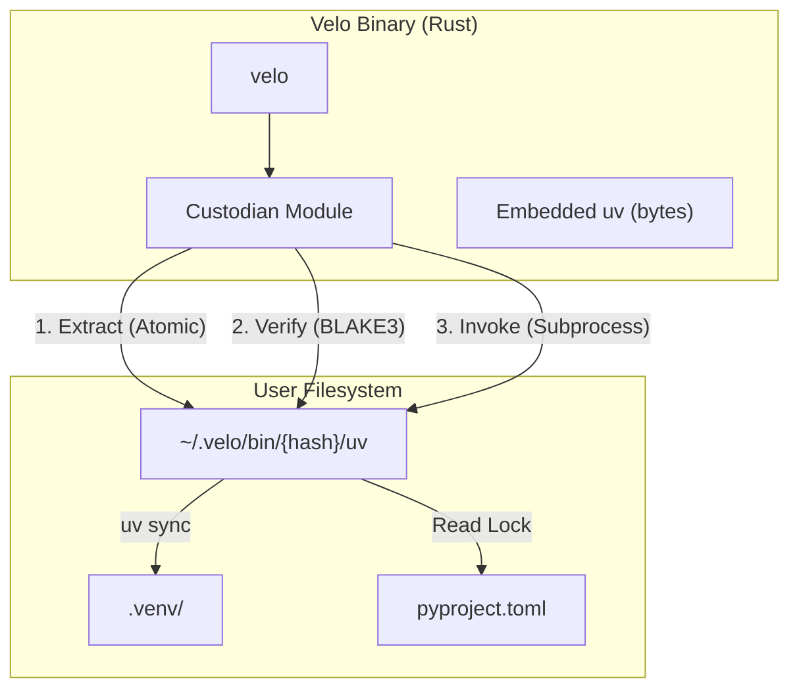
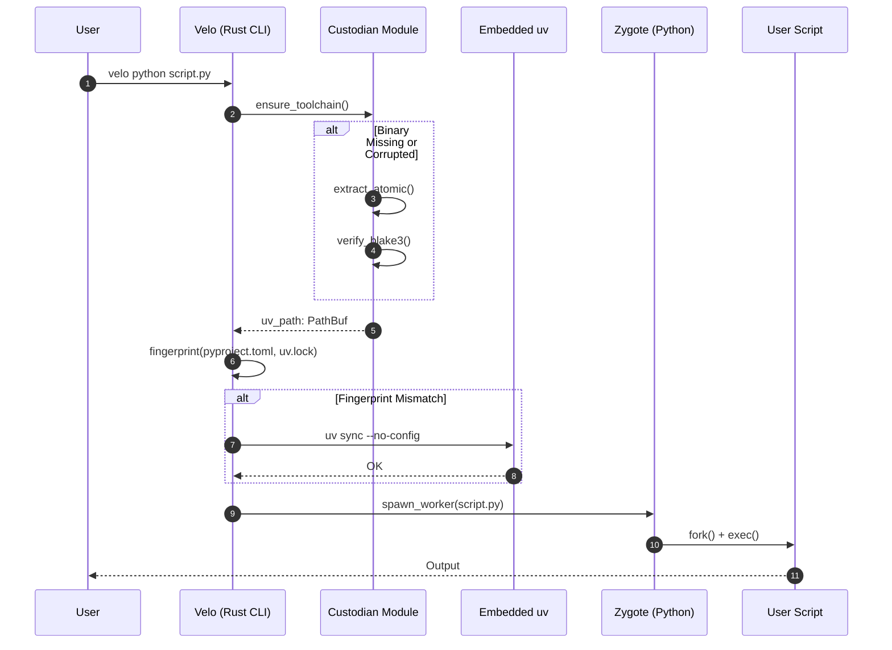
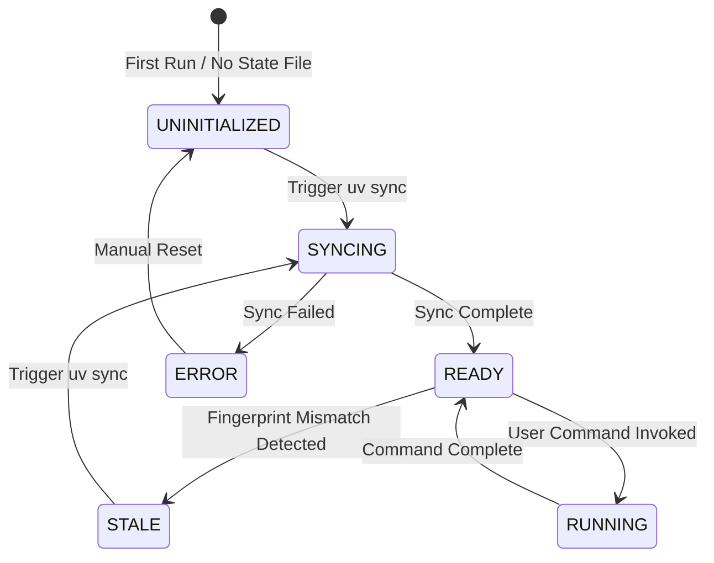

# Velo-uv Architecture: Command Flow & State Machine

> **Document Type**: Architectural Overview  
> **Phase**: 7.1 (Integrated Custody)  
> **Audience**: Developers, Architects, Users

## 1. User-Facing Vision: "Python, Unchained"

| Dimension | Traditional Mode | Velo Phase 7 |
| :--- | :--- | :--- |
| **Deployment Cost** | Install python, pip, uv, configure env | **Zero-Dependency**: Velo binary is everything. |
| **Latency Overhead** | TCP localhost (300-500μs) | **RSGI-Velo**: UDS zero-copy (< 50μs). |
| **Cold Start** | Python init (500ms+) | **Autopilot + Zygote**: < 50ms. |
| **Security Posture** | External sandbox, env pollution risk | **Surgical Shielding**: Rust owns signals & FDs. |

---

## 2. Velo-uv Relationship: The "Custody" Model



**Core Principle**: Velo **owns** the `uv` binary. It is not a peer, but a **managed asset**.

---

## 3. Command Flow: `velo python script.py`

This is the canonical "shadow command" flow.



---

## 4. State Machine: Environment Convergence

The system maintains a **fingerprint state file** at `.velo/env.state` to guarantee Single-Source-of-Truth (SSoT).



### State Definitions

| State | Description | Trigger to Exit |
| :--- | :--- | :--- |
| **UNINITIALIZED** | No `.venv` or state file exists. | `uv sync` is triggered. |
| **SYNCING** | `uv sync` is in progress. | Sync completes or fails. |
| **READY** | Environment is hermetic and verified. | User command or fingerprint change. |
| **STALE** | `pyproject.toml` or `uv.lock` has changed. | `uv sync` re-triggers. |
| **RUNNING** | A user script or serve command is active. | Command terminates. |
| **ERROR** | Sync or extraction failed. | Manual intervention required. |

---

## 5. Data Flow: `velo serve app:main`

This diagram illustrates the Native Sovereignty (Phase 7.2) architecture where Velo acts as the L7 HTTP host.

```mermaid
graph LR
    subgraph "External"
        CLIENT[HTTP Client]
    end

    subgraph "Velo Binary (Rust)"
        TCP[TCP Listener]
        HTTP[HTTP Parser (hyper)]
        LB[Load Balancer]
    end

    subgraph "RSGI-Velo Protocol (UDS)"
        IPC[Unix Domain Socket]
    end

    subgraph "Python Worker Pool"
        W1[Worker 1]
        W2[Worker 2]
        W3[Worker N]
    end

    CLIENT -- "1. TCP Connect" --> TCP
    TCP -- "2. Parse HTTP/1.1 or H2" --> HTTP
    HTTP -- "3. Route Request" --> LB
    LB -- "4. Send via SCM_RIGHTS" --> IPC
    IPC -- "5. Dispatch" --> W1
    W1 -- "6. ASGI/RSGI Response" --> IPC
    IPC -- "7. Return Body" --> HTTP
    HTTP -- "8. Send Response" --> CLIENT
```

### ABI Boundary (Trust Domains)

| Layer | Owner | Responsibility |
| :--- | :--- | :--- |
| **TCP/IP** | Rust (Velo) | Accept connections, TLS termination. |
| **HTTP Parsing** | Rust (hyper) | Parse headers, validate methods. |
| **Load Balancing** | Rust (Velo) | Distribute requests to workers. |
| **RSGI Framing** | Rust (rmp-serde) | Serialize/Deserialize MessagePack. |
| **ASGI Dispatch** | Python (Worker) | Execute user code. |
| **User Code** | Python (User) | Business logic. |

---

## 6. Security Summary (RFC-0012 Alignment)

| Invariant | Implementation |
| :--- | :--- |
| **SEC-ENV-001 (Provenance)** | Embedded `uv` is the sole toolchain source. |
| **SEC-FS-001 (TOCTOU)** | Atomic extraction via `rename()`. |
| **SEC-FS-002 (FD Hygiene)** | `close_range(3, ~0)` before worker spawn. |
| **SEC-IPC-001 (Socket Type)** | **Linux**: Abstract Namespace (`\0`-prefixed). **macOS**: `mkdtemp`-based path. |
| **P0-1 (Peer Auth)** | `SO_PEERCRED` on every UDS connection. |
| **P0-2 (Taint)** | Entropy re-randomization post-fork. |

> **Note**: Latency claims (< 50μs) are architectural targets. Benchmark validation pending Kinetic Regression Gate (Phase 7.2 MVP).
