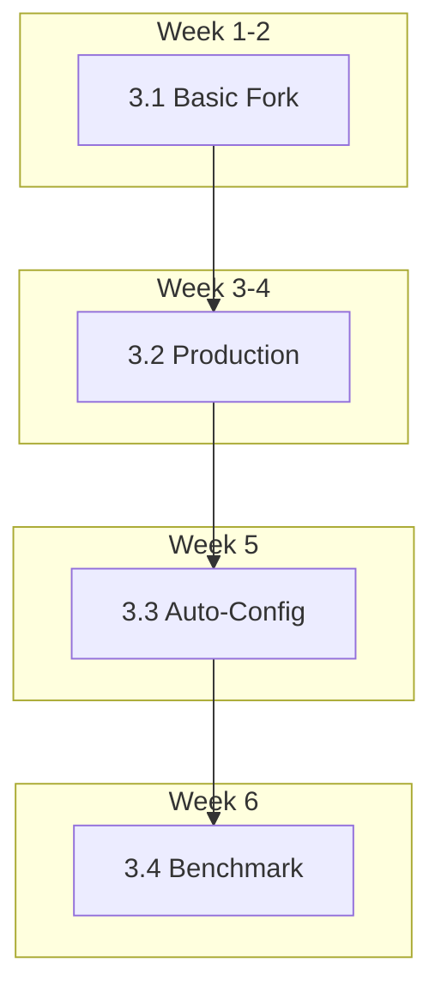

# Phase 3 Zygote: Developer Implementation Guide

> **Document Type**: Developer Priority Guide  
> **Parent Document**: [RFC-0002 Phase 3 Zygote](./0002-phase-3-zygote.md)  
> **Timeline**: W1-W6 (6 weeks)  
> **Last Updated**: 2026-01-02

---

## Overview

This document supplements RFC-0002 with detailed task breakdown and weekly priorities.

```
Week 1-2: Basic Fork    ──▶ velo run --zygote works
Week 3-4: Production    ──▶ Process management + error recovery  
Week 5:   Auto-Config   ──▶ velo zygote auto-config
Week 6:   Benchmark     ──▶ Documentation + performance validation
```

---

## TDD Development Methodology

> **⚠️ MANDATORY: All development MUST follow Test-Driven Development (TDD).**

### TDD Cycle

```
   ┌──────────────────────────────────────────────────────────┐
   │                    RED → GREEN → REFACTOR                │
   └──────────────────────────────────────────────────────────┘
   
   1. RED:      Write failing test first
   2. GREEN:    Write minimal code to pass test
   3. REFACTOR: Clean up code while keeping tests green
```

### Test-First Requirements

Before writing any implementation code, you MUST:

| Step | Action | Verification |
|------|--------|--------------|
| 1 | Write unit test in `tests/zygote_*.rs` | `cargo test` shows **FAIL** |
| 2 | Implement minimal code | `cargo test` shows **PASS** |
| 3 | Add QA adversarial test in `tests/qa/test_phase3_zygote.py` | `pytest` passes |
| 4 | Refactor with confidence | All tests remain green |

### Test ID Prefixes (Phase 3)

Per [STANDARDS.md](../STANDARDS.md) Section 3.1:

| Prefix | Category | Description |
|--------|----------|-------------|
| `ZYG-` | Zygote Core | Fork, IPC, lifecycle tests |
| `ZYG-PERF-` | Zygote Performance | **BLOCKING** - Startup timing |
| `ZYG-CHAOS-` | Zygote Chaos | Orphan cleanup, crash recovery |
| `ZYG-RACE-` | Zygote Concurrency | Parallel fork requests |

### Test File Structure

```
tests/
├── zygote_basic.rs         # Unit tests for basic fork
├── zygote_ipc.rs           # Unit tests for IPC
├── zygote_lifecycle.rs     # Unit tests for process management
└── qa/
    ├── test_phase3_zygote.py           # Core feature tests
    ├── test_phase3_zygote_chaos.py     # Adversarial tests
    └── test_phase3_zygote_perf.py      # Performance tests
```

### Per-Feature TDD Checklist

Before marking ANY task complete, verify:

- [ ] Unit test written **FIRST** (red)
- [ ] Implementation passes test (green)
- [ ] `cargo clippy -- -D warnings` clean
- [ ] `cargo fmt --check` passes
- [ ] Edge case tests added
- [ ] Documentation updated

---

## Quality Gate Compliance

Per [DEFINITION_OF_DONE.md](../DEFINITION_OF_DONE.md):

### Gate 1: Dev Handoff (Before QA)

```bash
# All must pass before notifying QA
cargo fmt --check
cargo clippy -- -D warnings  
cargo test
./scripts/test-phase3.sh
```

### Gate 2: QA Sign-off (Before Release)

| Metric | Gate Requirement |
|--------|------------------|
| Zygote startup | < 50ms (FastAPI) |
| Fork latency | < 5ms |
| Worker memory | < 50% standalone |
| No orphan processes | After 100 forks |

---

## Phase 3.1: Basic Fork (W1-2)

**Goal**: `velo run --zygote script.py` executes successfully

### Week 1: Core Skeleton

| Priority | Task | Test First | Output File |
|----------|------|------------|-------------|
| P0 | Unix Socket IPC | `tests/zygote_ipc.rs::test_socket_roundtrip` | `src/zygote/ipc.rs` |
| P0 | Zygote Python module | `tests/qa/test_phase3_zygote.py::test_zygote_ready_signal` | `velo_zygote/main.py` |
| P1 | CLI: `velo zygote start` | `tests/zygote_basic.rs::test_zygote_start` | `src/zygote/cli.rs` |
| P1 | CLI: `velo zygote stop` | `tests/zygote_basic.rs::test_zygote_stop` | `src/zygote/cli.rs` |

**Key Code Paths**:
```
src/
├── zygote/
│   ├── mod.rs          # Module entry
│   ├── ipc.rs          # Unix Socket communication
│   ├── launcher.rs     # Zygote process management
│   └── cli.rs          # CLI commands
└── main.rs             # Integrate zygote subcommand

velo_zygote/            # Python package
├── __init__.py
└── main.py             # Zygote main loop
```

### Week 2: Fork Execution

| Priority | Task | Test First | Output File |
|----------|------|------------|-------------|
| P0 | `--zygote` flag | `tests/zygote_basic.rs::test_zygote_flag_parsed` | `src/main.rs` |
| P0 | Fork + exec logic | `tests/qa/test_phase3_zygote.py::test_fork_executes_script` | `velo_zygote/main.py` |
| P1 | Error handling | `tests/zygote_basic.rs::test_zygote_error_messages` | `src/zygote/error.rs` |

**Milestone Acceptance**:
```bash
# TDD verification - run test script
./scripts/test-phase3.1.sh

# Manual verification
velo zygote start --preload numpy,pandas
time velo run --zygote test_script.py  # Should be < 100ms
velo zygote stop
```

---

## Phase 3.2: Production Hardening (W3-4)

**Goal**: Production-grade reliability

### Week 3: Process Management

| Priority | Task | Test First | Output File |
|----------|------|------------|-------------|
| P0 | Worker lifecycle | `tests/zygote_lifecycle.rs::test_worker_tracking` | `src/zygote/worker.rs` |
| P0 | Orphan cleanup | `tests/qa/test_phase3_zygote_chaos.py::test_no_orphans_after_stress` | `src/zygote/orphan.rs` |
| P1 | macOS kqueue | `#[cfg(target_os = "macos")]` tests | `src/zygote/platform/macos.rs` |
| P1 | Linux prctl | `#[cfg(target_os = "linux")]` tests | `src/zygote/platform/linux.rs` |

### Week 4: Error Recovery

| Priority | Task | Test First | Output File |
|----------|------|------------|-------------|
| P0 | Graceful Shutdown | `tests/zygote_lifecycle.rs::test_sigterm_handling` | `src/zygote/shutdown.rs` |
| P0 | Crash restart | `tests/qa/test_phase3_zygote_chaos.py::test_zygote_auto_restart` | `src/zygote/launcher.rs` |
| P1 | Log aggregation | `tests/zygote_lifecycle.rs::test_worker_logs_traceable` | `src/zygote/logging.rs` |
| P2 | `velo zygote status` | `tests/zygote_basic.rs::test_status_output` | `src/zygote/cli.rs` |

**Milestone Acceptance**:
```bash
# Chaos test - must pass
pytest tests/qa/test_phase3_zygote_chaos.py -v

# Stress test
for i in {1..100}; do velo run --zygote quick_script.py & done
wait
ps aux | grep velo_zygote  # Should only show main Zygote
```

---

## Phase 3.3: Auto-Configuration (W5)

**Goal**: Automated configuration generation

| Priority | Task | Test First | Output File |
|----------|------|------------|-------------|
| P0 | Parse profile data | `tests/zygote_auto.rs::test_profile_parsing` | `src/zygote/auto_config.rs` |
| P0 | `velo zygote auto-config` | `tests/qa/test_phase3_zygote.py::test_auto_config_generates_toml` | `src/zygote/cli.rs` |
| P1 | Hybrid auto-start | `tests/zygote_lifecycle.rs::test_hybrid_auto_start` | `src/zygote/launcher.rs` |
| P1 | Idle timeout exit | `tests/zygote_lifecycle.rs::test_idle_timeout` | `src/zygote/launcher.rs` |

**Milestone Acceptance**:
```bash
# Test auto-config
./scripts/test-phase3.3.sh

# Manual verification
velo run --profile slow_app.py
velo zygote auto-config
cat velo.toml  # Should contain preload = ["numpy", "pandas", ...]
```

---

## Phase 3.4: Benchmark & Documentation (W6)

**Goal**: Performance validation + documentation

| Priority | Task | Test First | Output File |
|----------|------|------------|-------------|
| P0 | Startup benchmark | `benches/zygote_startup.rs` | `scripts/benchmark_startup.sh` |
| P0 | Memory COW validation | `tests/qa/test_phase3_zygote_perf.py::test_cow_memory_sharing` | `scripts/benchmark_memory.sh` |
| P1 | User documentation | N/A | `docs/zygote.md` |
| P1 | Update README | N/A | `README.md` |

**Milestone Acceptance**:
```bash
# Performance benchmark - BLOCKING
./scripts/benchmark_startup.sh
# Expected:
# FastAPI cold start: 540ms -> 45ms (12x faster)  ✓ PASS if < 50ms
# Django cold start:  400ms -> 38ms (10x faster)  ✓ PASS if < 50ms

# COW memory validation
./scripts/benchmark_memory.sh --workers 10
# Expected: Total memory < 5x single worker memory
```

---

## Dependency Graph



---

## Test Scripts

### Dev Acceptance Test

Create `scripts/test-phase3.sh`:

```bash
#!/bin/bash
set -e

echo "=== Phase 3 Zygote Dev Acceptance ==="

# Gate 1: Code quality
echo ">>> Checking code quality..."
cargo fmt --check
cargo clippy -- -D warnings

# Gate 2: Unit tests
echo ">>> Running unit tests..."
cargo test zygote

# Gate 3: QA adversarial tests
echo ">>> Running QA tests..."
pytest tests/qa/test_phase3_zygote*.py -v

echo "=== All Phase 3 tests passed ==="
```

---

## Technical Debt & Notes

### Must Handle

- [ ] **fork() thread safety**: Ensure single-threaded state before fork
- [ ] **Windows fallback**: `--zygote` silently falls back to normal mode on Windows

### Deferred to Phase 3.5

- GPU memory (CUDA/MPS) sharing issues
- uvicorn/gunicorn integration
- Multiple Zygote instance support

---

## Related Documents

| Document | Description |
|----------|-------------|
| [RFC-0002](./0002-phase-3-zygote.md) | Technical design (architecture decisions) |
| [DEFINITION_OF_DONE.md](../DEFINITION_OF_DONE.md) | Quality gate standards |
| [STANDARDS.md](../STANDARDS.md) | Naming conventions, test categories |
| [Phase 1.5 QA Guide](../testing/phase-1.5-qa-guide.md) | Testing methodology reference |
