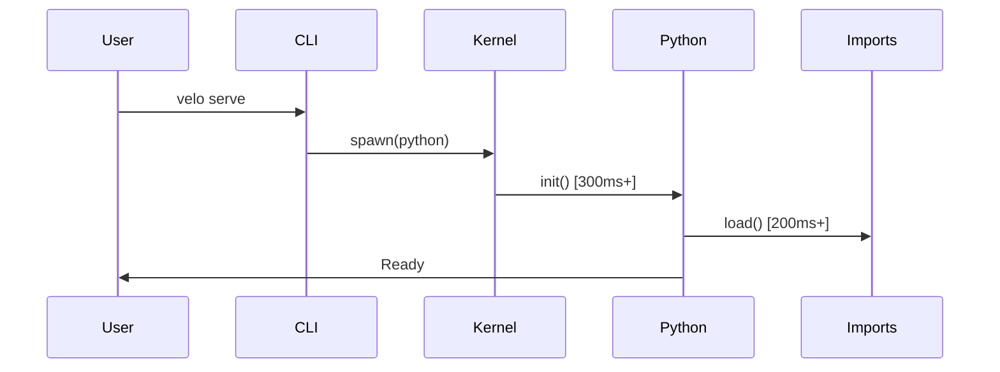
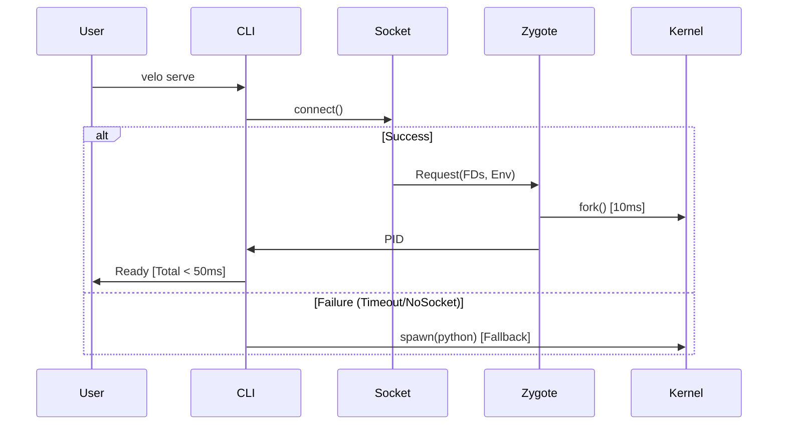

# RFC-0013: Kinetic Protocol (Zygote Weaponization)

> **Status**: **APPROVED** (v1.1 - P0 Fixes Applied)
> **Feature**: Kinetic Optimization (<50ms Startup)
> **Driver**: ID-LOCK-001 (Architect)

## 1. Abstract

This RFC defines the **Kinetic Protocol**, a localized IPC mechanism to aggressively optimize Velo's startup latency from ~590ms to <50ms. It shifts the `velo serve` architecture from a simple Process Spawner to a **Resilient IPC Client**.

## 2. The Architecture Shift

### 2.1 Current State (Cold Start)

### 2.2 New State (Kinetic Start)

## 3. The Kinetic Protocol Specification

### 3.1 The "Silent Fallback" Invariant (Rust Core Requirement)
**Rule**: The CLI must **NEVER** hang or crash if the Zygote is malfunctioning.
*   **Timeout**: The IPC handshake has a strictly enforced **10ms timeout**.
*   **Timeout Scope**: The 10ms covers the **ENTIRE** handshake (connect + auth + payload + ack).
*   **Action**: If 10ms elapses, or Connection Refused, or Protocol Error -> **IMMEDIATELY** drop to standard Cold Start.
*   **Fallback Triggers**: `EPIPE`, `ECONNRESET`, `ECONNREFUSED`, `ETIMEDOUT`.
*   **Visibility**: Fallback should be invisible to the user (except for the latency hit).

### 3.2 The Handshake
1.  **Probe**: Check `O_PATH` of socket (Security Shielding).
2.  **Auth**: Send `VELO_MAGIC` + `Version`.
3.  **Payload**: Send `StandardInput` / `Output` / `Error` file descriptors via SCM_RIGHTS.
4.  **Ack**: Receive `Child PID`.

## 4. Preload Strategy (Python Core Requirement)

### 4.1 Profile-Guided Optimization (PGO)
We cannot hardcode imports.
1.  **Record**: `velo analyze --profile` generates `.velo/kinetic_profile.json`.
2.  **Load**: Zygote reads this JSON on startup.
3.  **Validation**: A hash of `pyproject.toml` ensures the profile is fresh.
4.  **Max Size**: Profile must not exceed `64KB` to prevent DoS.

## 5. Security Implications (Security Specialist)
*   **Isolation**: The Zygote runs as the USER.
*   **Cleanup**: `SO_PEERCRED` must be checked on every connection.
*   **Taint**: Forked children are "Tainted" and must re-randomize seeds (`secrets`, `random`).

### 5.1 SO_PEERCRED Failure Handling (P0-1)
*   **Action**: If `getsockopt(SO_PEERCRED)` fails or UID mismatch → close socket immediately.
*   **Logging**: Log at `WARN` level with peer PID (if available).
*   **Fallback**: This does NOT trigger Cold Start fallback; it's a security rejection.
*   **macOS**: Use `getpeereid()` or `O_PATH` inode verification.

### 5.2 Taint Re-Randomization Contract (P0-2)
Post-fork, the child MUST call:
1.  `random.seed(secrets.token_bytes(32))`
2.  `os.urandom(1)` (force kernel entropy refill)

This MUST happen BEFORE any user code executes.

## 6. Implementation Plan
1.  **Rust**: `src/serve/runner.rs` implements `KineticClient`.
2.  **Python**: `velo_zygote/main.py` implements `KineticServer`.

