# RFC-0038: AI-Native Diagnostics & LLM-Friendly Profiling Protocol

**Type**: Protocol RFC
**Status**: Approved (Council Review 2026-01-23)
**Created**: 2026-01-22
**Author**: Antigravity (Arch)
**Target**: v0.9.5+

---

## 1. Summary

This RFC proposes a new diagnostic standard for Velo: **AI-Native Diagnostics**. 
By implementing structured Markdown output (`--prof-md`) for all performance-critical commands, Velo enables AI agents (like Claude, Gemini, and Cursor) to accurately parse, analyze, and optimize Python applications without regex-based guesswork.

> [!IMPORTANT]
> This RFC establishes a **Platform Contract**. The section headers and column names defined herein are part of Velo's **Stable Public Protocol** to ensure long-term Agent compatibility.

---

## 2. Motivation

### 2.1 The Agentic Era
Modern development is increasingly "Agent-First." AI agents perform code reviews, fix performance regressions, and manage infra. However, most CLI tools output ANSI-encoded text optimized for human eyeballs, which is sub-optimal for LLMs.

### 2.2 The AI-First Infrastructure Thesis
In the upcoming AI Era, the primary "users" of infrastructure are no longer humans, but AI Agents. Traditional CLI diagnostics optimized for terminal rendering are a legacy burden. Velo mandates a structural shift: **Infrastructure must be machine-native to be human-useful.** Velo is architected to be the bridge where the runtime speaks the same language as the Agent assisting the developer.

### 2.3 Problems with Current Output
1.  **ANSI Noise**: Escape codes confuse smaller LLMs and waste token context.
2.  **Unstructured Timing**: Chronological logs are harder to grep than tabulated data.
3.  **Context Gap**: Knowing a function is "Hot" at `line 45` isn't enough; the Agent needs to see the signature to suggest a fix immediately.
4.  **Stream Pollution**: Dumping diagnostics to `stdout` breaks piping for tools like `jq` or `grep`.

---

## 3. Proposed Protocol

### 3.1 Output Dest & Truncation
- **Default**: Diagnostics MUST be written to `stderr` or a specified file (`--prof-md=report.md`).
- **Alternative Format**: For programmatic CI Agents, `--prof-json=report.json` MAY be supported as a v1.1 extension.
- **Truncation**: Large tables (Hot Functions) MUST be truncated to the **Top 20** entries to prevent token overflow. A summary footer (e.g., "...and 45 other calls") must be included.

### 3.2 Standard Output Schema (GFM)
Output must follow GitHub Flavored Markdown (GFM) standards and include **Context Snippets**.

> [!IMPORTANT]
> **Placement Rule**: The `## 📋 Summary` table MUST appear immediately after the report title to allow Agents to perform "Early Skip" decisions for token efficiency.

#### Example: `velo run --prof-md script.py`
```markdown
<!-- velo:diagnostics v=1 -->
# Velo Diagnostic Report v1

## 📋 Summary
| Key | Value |
| :--- | :--- |
| **Total Runtime** | 1.04s |
| **Slowest Import** | `torch` |
| **Optimization Budget**| CPU-bound |
| **Status** | 🟢 Within Budget |

| Metric | Value | Status |
| :--- | :--- | :--- |
| **Startup (Zygote)** | 12ms | ⚡ Instant |
| **Memory Delta** | +24MB | ✅ COW Efficient |

## 💻 System Environment
| Variable | Value |
| :--- | :--- |
| **VELO_MODE** | `dev` |
| **PYTHON_GIL** | `Enabled` |
| **PLATFORM** | `Darwin 14.2` |

> [!CAUTION]
> **Secrets Sanitizer**: The environment dumper MUST apply a `sensitive_key_filter`. Any variable name containing `KEY`, `SECRET`, `TOKEN`, or `PASSWORD` (case-insensitive) MUST have its value redacted to `***` before output.
>
> **Note**: This is a best-effort keyword filter. Production deployments handling sensitive data should use dedicated secret management systems.

## 🐢 Slow Imports (Critical Path)

> [!NOTE]
> This section profiles **module import times**, not function execution. For function-level profiling, use `cProfile` or `py-spy`.

### 1. `torch` (462ms)
**Location:** `torch/__init__.py (CUDA init)`
> **Agent Hint [preload-miss]**: GPU initialization. Use Zygote pre-warming.

### 2. `numpy` (68ms)
**Location:** `numpy/__init__.py (C-extension init)`
> **Agent Hint [preload-miss]**: C-Extension. Consider Zygote pre-warming.

## Slow Imports (Top 20)
| Import % | Time | Module | Location |
| :--- | :--- | :--- | :--- |
| 87.2% | 462ms | `torch` | `torch/__init__.py` |
| 12.8% | 68ms | `numpy` | `numpy/__init__.py` |
... (truncated) ...
```

## Startup Timeline
- `[0ms]` Zygote Spawn
- `[4ms]` Environment Shield Active
- `[12ms]` Application Entry
- `[462ms]` First Heavy Import (`torch`) **(Preloaded via RFC-0035, COW-shared)**

### 3.3 Agent-Friendly Markers
- Use `**` for emphasis on bottlenecks.
- Use `##` for clear sectioning.
- Include a `# Summary` at the top for quick context.

### 3.4 Mermaid Integration (Visual Dependency Graph)
The report MAY include a Mermaid Gantt chart for the startup timeline. This provides dual utility: a visual timeline for human users in GitHub/VS Code previews, and a precise temporal dependency graph for Agents.

```mermaid
gantt
    title Velo Startup Phase
    dateFormat  x
    axisFormat %Lms
    section Boot
    Zygote       : 0, 12
    Env Shield   : 4, 12
    section Runtime
    App Entry    : 12, 462
    Torch Import : crit, 462, 890
```




---

## 4. Implementation Details

### 4.1 CLI Arg Refactor
Add a boolean flag `prof_md` to `RunCmd` and `BenchCmd`.

### 4.2 Formatter Module
Implement a `MarkdownFormatter` in `src/common/diagnostics.rs`. 
- **Efficiency**: Use `std::fmt::Write` to build the string buffer without excessive heap allocations.
- **Purity**: Use `strip-ansi-escapes` to ensure no binary noise enters the token stream.
- **Safety**: Verify UTF-8 compatibility to prevent breaking LLM decoders with corrupted binary garbage.

### 4.3 Atomic Writing
The Markdown report MUST be written **atomically** at the end of the process execution. This prevents AI agents from reading partial or corrupted MD files during a crash. 

### 4.4 Extension Points
- **Agent Hints**: Reserved tag format `[tag-name]` for future routing hints. See **Appendix A: Agent Hint Taxonomy** for the canonical list.
    - **Constraint**: Agent Hints MUST be derived from empirical telemetry, not LLM speculation.
- **AI Suggestions**: Future releases may include a `## 🤖 AI Suggestions (Experimental)` section, which MUST be explicitly labeled to distinguish from empirical telemetry.

### 4.5 Protocol Versioning Strategy (SemVer)
To ensure Agent prompts remain stable over years of evolution:
- **Minor Version (v1.1)**: Adding new columns or sections is allowed. Agents MUST be prompted to ignore unknown keys.
- **Major Version (v2.0)**: Renaming existing columns or changing units (e.g., `ms` to `us`) requires a major version bump.
- **Guarantee**: Velo guarantees backward compatibility for the `## 📋 Summary` and `## Hot Functions` table structures for at least 6 months post-deprecation.

---

## 5. AI Integration: Reference Prompt

Velo provides a **Reference System Prompt Preamble** for AI-assisted profiling:

> "You are a Performance Engineer. When analyzing Velo Markdown Reports (RFC-0038), prioritize 'Self Time' over 'Total Time' to find actual optimization targets. Use the provided 'Code Context Snippets' to identify algorithmic inefficiencies without manually reading files unless necessary."

---

## 6. Value Proposition

1.  **Lower TCO (Total Cost of Optimization)**: AI agents can fix performance bugs in seconds.
2.  **Marketing Alignment**: Positions Velo as the "World's First AI-Native Python Runtime."
3.  **Integration**: Seamless integration with Cursor, VS Code Copilot, and custom DevOps agents.

## 7. Future Work: Differential Analysis

Velo's deterministic Markdown output enables a powerful future workflow: **Differential Diagnostics**.

Velo targets a future `velo diff baseline.md current.md` command. This will generate a **Delta Report** specifically designed for Agents to comment on Pull Requests (e.g., *"Performance Regression: `heavy_compute` slowed down by 150ms"*).

---

## 8. Engineering Risks

- **Runtime Overhead**: Capturing data for detailed profiling always adds overhead. This should only run when requested.
- **Protocol Stability**: Moving to a structured format requires stable column names to avoid breaking AI prompts.

---

## 9. Open Questions

- Should we support JSON instead of Markdown? 
    - **Decision**: Markdown is preferred as it is human-readable AND LLMs are natively trained on Markdown structure, whereas JSON consumes more tokens and can be more brittle for partial reads.
- Should we provide an `--ai-fix` suggestion? 
    - **Future Phase**: Velo could potentially include an AI-generated suggestion in the MD report if an API key is provided.

---

## 10. Quality Gates

- **Gate A**: Output passes standard Markdown linting (`mdl`).
- **Gate B**: AI-generated "Top 3 bottlenecks" from the report match actual data with 100% accuracy.
- **Gate C**: `--prof-md` profiling overhead MUST be less than **5%** of total execution time.

---

## Appendix A: Agent Hint Taxonomy

The following Agent Hints are reserved for structured routing. New hints require RFC amendment.

| Tag | Meaning | Typical Action |
| :--- | :--- | :--- |
| `[loop-hot]` | High self-time inside a loop | Check nested iterations, vectorize |
| `[io-blocking]` | Synchronous I/O blocking event loop | Suggest async/await refactor |
| `[memory-leak]` | Memory growth without release | Audit object lifecycle |
| `[gil-contention]` | GIL blocking multi-threaded work | Suggest multiprocessing |
| `[preload-miss]` | Library not in RFC-0035 preload cache | Add to `[tool.velo.native_preload]` |
