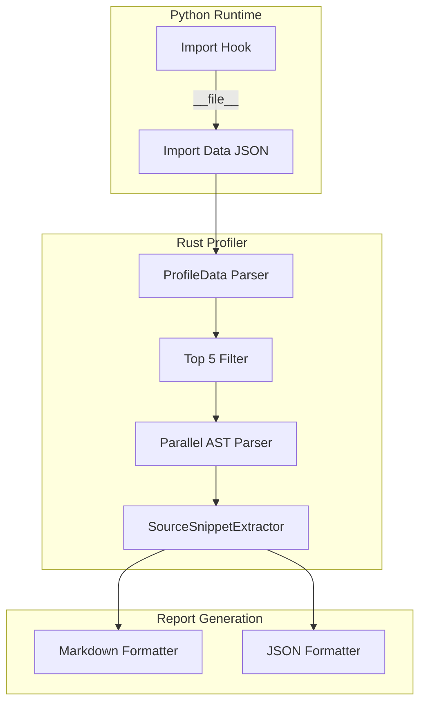

# RFC-0038 Extension: Code Context Snippets

> **Status**: Proposed (v1.0 Target)  
> **Parent RFC**: [RFC-0038: AI-Native Diagnostics](./0038-ai-native-diagnostics.md)  
> **Priority**: P2 Enhancement

---

## 1. Problem Statement

The current `--prof-md` / `--prof-json` output reports **slow import module names** but lacks **source code context**. AI Agents must perform additional file reads to understand the bottleneck's nature, consuming extra tokens and increasing latency.

### Current Output
```markdown
### 1. `torch` (462ms)
**Location:** `torch/__init__.py (CUDA init)`
> **Agent Hint [preload-miss]**: C-Extension. Consider Zygote pre-warming.
```

### Target Output
```markdown
### 1. `torch` (462ms)
**Location:** `torch/__init__.py:15`
**Signature:** `def _init_extension() -> None:`
```python
def _init_extension() -> None:
    """Initialize CUDA and native extensions."""
    from torch._C import _initExtension
    _initExtension()
```
> **Agent Hint [preload-miss]**: C-Extension initialization. Consider Zygote pre-warming.
```

---

## 2. Technical Challenges

### 2.1 Module Path Unavailable
| Issue | Current State |
|:---|:---|
| Import hook captures | Module **name** only ("numpy") |
| Required for snippets | Module **`__file__`** path |

**Solution**: Extend `SITECUSTOMIZE_PY` to capture file paths.

### 2.2 AST Parsing Overhead
| Operation | Time Cost |
|:---|:---|
| Read source file | 0.5-2ms |
| Parse AST (rustpython) | 5-20ms per file |
| Extract signature | <1ms |

**For 20 modules**: ~100-400ms additional overhead.

**Solutions**:
1. Only parse **Top 5** slowest modules
2. Use **parallel parsing** with rayon

### 2.3 Missing Source Files
| Case | Prevalence |
|:---|:---|
| Pure Python (.py) | ~60% |
| Pre-compiled wheels (.pyc only) | ~30% |
| C extensions (.so/.pyd) | ~10% |

**Solution**: Graceful degradation with informative messages.

### 2.4 Entry Point vs Actual Bottleneck
Module `__file__` points to `__init__.py`, but slow code may be in submodule.

**Solution**: Note limitation in output when snippet unavailable.

---

## 3. Architecture



### 3.1 Data Flow

```
┌─────────────────────────────────────────────────────────────┐
│                     Python Import Hook                       │
│  _velo_import_data[name] = { elapsed, __file__, __name__ }  │
└─────────────────────┬───────────────────────────────────────┘
                      │ JSON serialization
                      ▼
┌─────────────────────────────────────────────────────────────┐
│                      Rust ProfileData                        │
│  SlowImportInfo { name, duration_ms, file_path }            │
└─────────────────────┬───────────────────────────────────────┘
                      │ Top 5 filter
                      ▼
┌─────────────────────────────────────────────────────────────┐
│               SourceSnippetExtractor (rayon)                 │
│  rustpython_parser → extract function signature + docstring │
└─────────────────────┬───────────────────────────────────────┘
                      │ Graceful degradation
                      ▼
┌─────────────────────────────────────────────────────────────┐
│                 SlowImportInfo.code_snippet                  │
│  Option<CodeSnippet> { signature, lines: [0..5] }           │
└─────────────────────────────────────────────────────────────┘
```

---

## 4. Implementation Phases

### Phase 1: Hook Extension (Low Risk)
**File**: `src/profile.rs` → `SITECUSTOMIZE_PY`

```python
def _velo_timed_import(name, *args, **kwargs):
    start = time.perf_counter()
    module = _velo_original_import(name, *args, **kwargs)
    elapsed = (time.perf_counter() - start) * 1000
    
    if elapsed > 1.0:  # Only for slow imports
        _velo_import_data[name] = {
            "elapsed_ms": elapsed,
            "file": getattr(module, '__file__', None),
            "package": getattr(module, '__package__', None)
        }
    return module
```

### Phase 2: ProfileData Extension (Low Risk)
**File**: `src/profile.rs`

```rust
pub struct SlowImportInfo {
    pub name: String,
    pub duration_ms: f64,
    pub file_path: Option<PathBuf>,  // NEW
    pub location: Option<String>,
    pub code_snippet: Option<CodeSnippet>,  // NEW
    pub agent_hint: Option<AgentHint>,
}

pub struct CodeSnippet {
    pub signature: String,
    pub lines: Vec<String>,  // Max 5 lines
    pub start_line: u32,
}
```

### Phase 3: Source Snippet Extractor (Medium Risk)
**File**: `src/common/snippet_extractor.rs` (NEW)

```rust
use rustpython_parser::parse;
use rustpython_ast::Stmt;
use rayon::prelude::*;

pub fn extract_module_entry_snippet(file_path: &Path) -> Option<CodeSnippet> {
    // 1. Check file exists and is readable
    if !file_path.exists() || file_path.extension().map(|e| e == "so").unwrap_or(false) {
        return None;
    }
    
    // 2. Read source
    let source = std::fs::read_to_string(file_path).ok()?;
    
    // 3. Parse AST
    let ast = parse(&source, rustpython_parser::Mode::Module, "<source>").ok()?;
    
    // 4. Find first function or class definition
    for stmt in ast.into_iter() {
        match stmt {
            Stmt::FunctionDef(f) => return Some(extract_function_snippet(&f, &source)),
            Stmt::ClassDef(c) => return Some(extract_class_snippet(&c, &source)),
            _ => continue,
        }
    }
    
    None
}

pub fn extract_snippets_parallel(imports: &[SlowImportInfo]) -> Vec<Option<CodeSnippet>> {
    imports.par_iter()
        .take(5)  // Only top 5
        .map(|i| i.file_path.as_ref().and_then(extract_module_entry_snippet))
        .collect()
}
```

### Phase 4: Report Integration (Low Risk)
**File**: `src/common/diagnostics.rs`

```rust
// In format_report():
for (i, import) in slow_imports.iter().take(20).enumerate() {
    md.push_str(&format!("### {}. `{}` ({:.1}ms)\n", i + 1, import.name, import.duration_ms));
    
    if let Some(ref snippet) = import.code_snippet {
        md.push_str(&format!("**Location:** `{}:{}`\n", 
            import.file_path.as_ref().map(|p| p.display().to_string()).unwrap_or_default(),
            snippet.start_line
        ));
        md.push_str(&format!("**Signature:** `{}`\n", snippet.signature));
        md.push_str("```python\n");
        for line in &snippet.lines {
            md.push_str(line);
            md.push('\n');
        }
        md.push_str("```\n");
    } else if let Some(loc) = &import.location {
        md.push_str(&format!("**Location:** `{}`\n", loc));
        md.push_str("> ⚠️ Source unavailable (C-extension or pre-compiled)\n");
    }
    // ... agent hints
}
```

---

## 5. Performance Budget

| Metric | Target | Mitigation |
|:---|:---|:---|
| Additional overhead (Top 5) | <100ms | Parallel parsing |
| Memory for AST | <10MB | Parse one at a time if memory constrained |
| Report size increase | <2KB | 5-line limit per snippet |

---

## 6. Graceful Degradation Matrix

| File Type | Action |
|:---|:---|
| `.py` exists | Parse and extract snippet |
| `.pyc` only | Try to find `.py`, else show warning |
| `.so` / `.pyd` | Show "C-extension, source unavailable" |
| Parse failure | Fall back to current location hint |

---

## 7. Test Plan

### Unit Tests
- [ ] `test_extract_function_snippet` - Basic function extraction
- [ ] `test_extract_class_snippet` - Class definition extraction
- [ ] `test_missing_source_graceful` - .so files handled
- [ ] `test_parse_failure_graceful` - Invalid Python handled

### Integration Tests
- [ ] `test_prof_md_with_snippets` - Full report with snippets
- [ ] `test_prof_json_with_snippets` - JSON output includes snippets
- [ ] `test_snippet_performance` - <100ms for 5 modules

---

## 8. Future Considerations

1. **Caching**: Cache parsed AST for frequently imported modules
2. **Deep Analysis**: Follow import chain to find actual slow code
3. **Line-level Timing**: Use py-spy integration for function-level profiling

---

## 9. Security Considerations

> [!CAUTION]
> This section addresses **P0 security issues** identified in [Council Review](./0011-reviews/RFC-0038-EXT-COUNCIL-REVIEW.md).

### 9.1 Path Traversal Defense (SEC-001)

**Risk**: Malicious packages could set `__file__` to sensitive paths like `/etc/passwd`.

**Mitigation**:
```rust
fn is_safe_file_path(path: &Path) -> bool {
    // 1. Must be absolute path
    if !path.is_absolute() {
        return false;
    }
    
    // 2. Must be within known safe directories
    let safe_prefixes = [
        "/lib/python",          // System site-packages
        "/usr/lib/python",
        "/.venv/",              // Virtual environments
        "/site-packages/",      // Pip packages
        "/dist-packages/",      // Debian packages
    ];
    
    let path_str = path.to_string_lossy();
    safe_prefixes.iter().any(|prefix| path_str.contains(prefix))
        || path_str.starts_with(std::env::current_dir().unwrap().to_string_lossy().as_ref())
}

pub fn extract_module_entry_snippet(file_path: &Path) -> Option<CodeSnippet> {
    // SECURITY: Validate path before reading
    if !is_safe_file_path(file_path) {
        return None;
    }
    // ... rest of implementation
}
```

### 9.2 Secret Sanitization in Snippets (SEC-002)

**Risk**: Code snippets may contain hardcoded secrets (`API_KEY = "sk-..."`)

**Mitigation**:
```rust
fn sanitize_snippet_line(line: &str) -> String {
    let secret_patterns = ["KEY", "SECRET", "TOKEN", "PASSWORD", "CREDENTIAL"];
    
    // Check if line contains assignment with secret-like variable
    if secret_patterns.iter().any(|p| line.to_uppercase().contains(p)) {
        if line.contains('=') || line.contains(':') {
            return "# [REDACTED - Potential Secret]".to_string();
        }
    }
    line.to_string()
}

// Apply to each line in snippet
snippet.lines = snippet.lines.iter()
    .map(|l| sanitize_snippet_line(l))
    .collect();
```

### 9.3 File Size Limit

**Risk**: Malicious `__file__` pointing to large files or `/dev/urandom`.

**Mitigation**:
```rust
const MAX_SOURCE_SIZE: u64 = 1_048_576;  // 1MB

fn read_source_safely(path: &Path) -> Option<String> {
    let metadata = std::fs::metadata(path).ok()?;
    if metadata.len() > MAX_SOURCE_SIZE {
        return None;
    }
    std::fs::read_to_string(path).ok()
}
```

---

## 10. Error Handling

> [!IMPORTANT]
> This section addresses **P0 stability issues** from Council Review.

### 10.1 Rayon Panic Handling (PANIC-001)

**Risk**: AST parsing panic in parallel thread crashes Velo process.

**Mitigation**:
```rust
use std::panic;

pub fn extract_snippets_parallel(imports: &[SlowImportInfo]) -> Vec<Option<CodeSnippet>> {
    imports.par_iter()
        .take(5)
        .map(|i| {
            // SAFETY: Catch any panics during parsing
            panic::catch_unwind(|| {
                i.file_path.as_ref().and_then(extract_module_entry_snippet)
            }).unwrap_or(None)
        })
        .collect()
}
```

### 10.2 Namespace Package Handling (COMPAT-001)

**Risk**: Namespace packages have `__file__ = None`, frozen modules have `<frozen>`.

**Mitigation** (Python hook):
```python
def _velo_timed_import(name, *args, **kwargs):
    start = time.perf_counter()
    module = _velo_original_import(name, *args, **kwargs)
    elapsed = (time.perf_counter() - start) * 1000
    
    if elapsed > 1.0:
        file_path = getattr(module, '__file__', None)
        
        # Skip namespace packages and frozen modules
        if file_path is None or file_path.startswith('<'):
            file_path = None
        
        _velo_import_data[name] = {
            "elapsed_ms": elapsed,
            "file": file_path,
            "is_namespace": file_path is None
        }
    return module
```

### 10.3 Threshold Configuration

The 1.0ms threshold should be configurable:

```python
_VELO_IMPORT_THRESHOLD_MS = float(os.environ.get('VELO_IMPORT_THRESHOLD_MS', '1.0'))

if elapsed > _VELO_IMPORT_THRESHOLD_MS:
    # ... capture data
```

---

## 11. Benchmark Requirements

> [!WARNING]
> The performance budget (<100ms) MUST be validated with benchmarks before merge.

### Required Benchmarks

```rust
#[cfg(test)]
mod bench {
    use criterion::{black_box, criterion_group, Criterion};
    
    fn bench_snippet_extraction(c: &mut Criterion) {
        c.bench_function("extract_5_snippets", |b| {
            b.iter(|| {
                extract_snippets_parallel(black_box(&test_imports))
            })
        });
    }
}
```

| Metric | Target | Gate |
|:---|:---|:---|
| Top 5 snippet extraction | <100ms | **Must pass** |
| Single file AST parse | <50ms | Advisory |
| Memory peak | <10MB | Advisory |

---

## References

- [RFC-0038: AI-Native Diagnostics](./0038-ai-native-diagnostics.md)
- [Council Review](./0011-reviews/RFC-0038-EXT-COUNCIL-REVIEW.md)
- [rustpython_parser documentation](https://docs.rs/rustpython-parser)
- [rayon parallel iterator](https://docs.rs/rayon)

