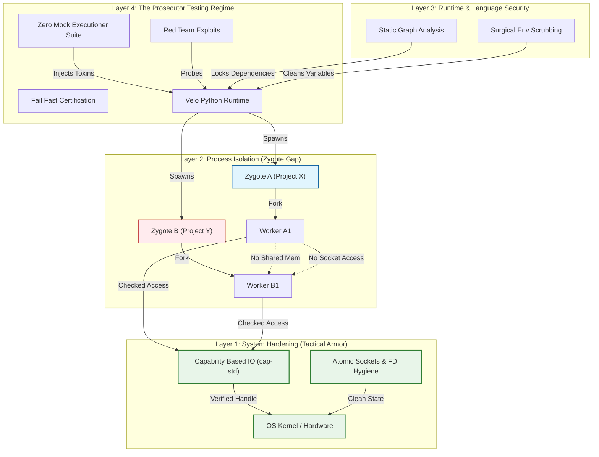

```mermaid
graph TD
    subgraph "Layer 4: The Prosecutor Testing Regime"
        Test[Zero Mock Executioner Suite]
        Attack[Red Team Exploits]
        FailClosed[Fail Fast Certification]
        Test -->|Injects Toxins| Runtime
        Attack -->|Probes| Runtime
    end

    subgraph "Layer 3: Runtime & Language Security"
        Runtime[Velo Python Runtime]
        StaticGraph[Static Graph Analysis]
        Scrub[Surgical Env Scrubbing]
        
        StaticGraph -->|Locks Dependencies| Runtime
        Scrub -->|Cleans Variables| Runtime
    end

    subgraph "Layer 2: Process Isolation (Zygote Gap)"
        ZygoteA["Zygote A (Project X)"]
        ZygoteB["Zygote B (Project Y)"]
        WorkerA1[Worker A1]
        WorkerB1[Worker B1]
        
        Runtime -- Spawns --> ZygoteA
        Runtime -- Spawns --> ZygoteB
        ZygoteA -- Fork --> WorkerA1
        ZygoteB -- Fork --> WorkerB1
        
        style ZygoteA fill:#e1f5fe,stroke:#01579b
        style ZygoteB fill:#ffebee,stroke:#b71c1c
        
        WorkerA1 -.-> |No Shared Mem| WorkerB1
        WorkerA1 -.-> |No Socket Access| WorkerB1
    end

    subgraph "Layer 1: System Hardening (Tactical Armor)"
        Kernel["OS Kernel / Hardware"]
        CapStd["Capability Based IO (cap-std)"]
        Hygiene["Atomic Sockets & FD Hygiene"]
        
        WorkerA1 -->|Checked Access| CapStd
        WorkerB1 -->|Checked Access| CapStd
        CapStd -->|Verified Handle| Kernel
        Hygiene -->|Clean State| Kernel
    end

    classDef shield fill:#e8f5e9,stroke:#2e7d32,stroke-width:2px;
    class Kernel,CapStd,Hygiene shield
```
