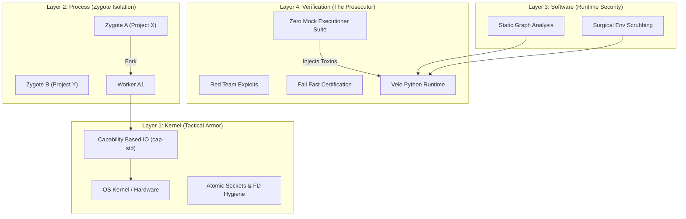

# Velo Master Security Standard (TITANIUM Status)

This document consolidates all security invariants, implementation patterns, and specialized standards (including RFC-0012 Surgical Shielding) for the Velo high-performance Python runtime. 
It is governed by the **[Grand Council of 20](../architecture/sop_master_lifecycle.md)**.

## 1. Security Invariant Matrix (H-1 to H-16)

Mandatory invariants enforced across all Velo components (CLI, Rust Loader, Python Zygote).

| ID | Invariant | Enforcement Layer | Status |
|:---|:---|:---|:---:|
| **H-1** | Global BLAKE3 Hash Verification | Rust Loader (`verify.rs`) | ✅ VERIFIED |
| **H-2** | Atomic `flock` Read Pattern | Rust Loader (`run.rs`) | ✅ VERIFIED |
| **H-3** | Keyed Environment Binding | Rust CLI / Cache | ✅ VERIFIED |
| **H-4** | Marshal Bomb Protection (Depth 500) | Python Loader / Rust Pre-scan | ✅ VERIFIED |
| **H-5** | Path Traversal / Symlink Escape | Rust Validation | ✅ VERIFIED |
| **H-6** | Reserved Name Protection | Python `VeloFinder` | ✅ VERIFIED |
| **H-7** | Bundle Size Limits (256MB) | Rust `fstat` check | ✅ VERIFIED |
| **H-8** | Component Version Mismatch Detection | Rust Header Check | ✅ VERIFIED |
| **H-9** | ABI Compatibility Fingerprint | Env Cache / Python Probe | ✅ VERIFIED |
| **H-10** | Structural Guard Recursion Limit | Rust Static Analysis | ✅ VERIFIED |
| **H-11** | Watcher Debouncer Hard-Cap | Rust `watcher.rs` | ✅ VERIFIED |
| **H-12** | Health Response Recon Guard | Rust `health.rs` | ✅ VERIFIED |
| **H-13** | FD Inheritance Purge | `runner.rs` / `mod.rs` | ✅ VERIFIED |
| **H-14** | Environment Provenance Guard | `mod.rs` | ✅ VERIFIED |
| **H-15** | Atomic Socket umask(077) | `ipc.rs` | ✅ VERIFIED |
| **H-16** | Peer Authentication (`SO_PEERCRED`) | `ipc.rs` | ✅ VERIFIED |

## 2. Surgical Shielding (RFC-0012)

RFC-0012 establishes the **Surgical Shielding Standard** to resolve regressions from broad blocking by shifting to targeted whitelisting and unique workspace identities.

### 2.1 The Three Sins of Brute Force Security
1. **Environment Suffocation**: Aggressive `env_clear()` removing critical `.venv` variables.
2. **Seatbelt Death Spiral**: Restrictive blocking of `/tmp` preventing internal IPC.
3. **Workspace Collision**: Fixed Unix socket paths causing cross-project hijacking.

### 2.2 Surgical Environment Management
- **Mandatory Whitelist**: `PATH`, `HOME`, `USER`, `TMPDIR`, `XDG_RUNTIME_DIR`, `SHELL`, `VIRTUAL_ENV`, `CONDA_PREFIX`, `LANG`, `LC_ALL`, `LC_CTYPE`, `TZ`, `TERM`, `TERM_PROGRAM`.
- **macOS Essentials**: `__CF_USER_TEXT_ENCODING`, `MallocNanoZone`, `XPC_FLAGS`, `XPC_SERVICE_NAME`.
- **Dangerous Blacklist**: `LD_PRELOAD`, `DYLD_INSERT_LIBRARIES`, `LD_LIBRARY_PATH`, `PYTHONPATH` (override), `PYTHONHOME`.

### 2.3 Unique Zygote Identity (Anti-Hijack)
- **Linux**: Abstract Namespace Sockets (`@velo-zygote-<hash>`).
- **macOS/BSD**: Randomized temporary directory via `mkdtemp` (perm 700).
- **Atomic Hygiene**: Mandatory `umask(077)` before socket creation.

### 2.4 System Hardening (Layer 1)
- **Capability-Based I/O**: Use of `cap-std` for TOCTOU resistance.
- **FD Purge**: `close_range(3, ~0)` on Linux; otherwise loop 3..RLIMIT_NOFILE.
- **Signal Mask**: Reset signal mask in `pre_exec` to ensure responsiveness to `SIGTERM`.

## 3. The 4-Layer Velo Fortress Model

## 4. Path Validation Pattern (SEC-P0-002)

To prevent Path Traversal, Velo implements a tiered validation pattern:
1. **Canonicalization**: Resolve symlinks and `..`.
2. **Root Anchoring**: Ensure path starts with the project root.
3. **Early Rejection**: Validate before any I/O or subprocess spawn.

## 5. Certification History
- **2026-01-06**: Reached **TITANIUM Certification**. Verified defense against the "Three Sins".
- **2026-01-06**: Rectified `velo serve` security divergence by replacing environment blacklist with `EnvironmentShield` whitelist.

---
*Conversation references: 5feed919-71ef-413d-a2bc-8d35dad5f505 (Certification), Phase 6.1.1 Audit*
