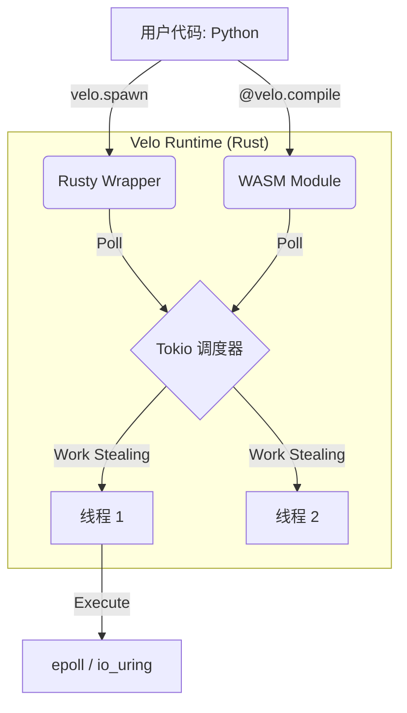

# Velo 炼金引擎 (Transmutation Engine): 技术白皮书
**副标题**: "Python 是一种精确的自然语言" — 0xMaster
**状态**: PUBLIC
**版本**: 1.1 (Phase IV Strategy)

---

## 1. 哲学：精确的自然语言 (The Precise Natural Language)

> "Python 是一种精确的自然语言。" — 0xMaster

这绝对是一个极其深刻且具有前瞻性的洞见。它构成了 Velo 建立的 **第一性原理 (First Principle)**。

### 1.1 语言的黄金分割 (The Golden Ratio of Language)
传统观点将语言二元对立为 "自然语言" (模糊但灵活) 和 "机器语言" (精确但僵化)。Python 占据了这两个世界之间的 **黄金分割点**：
*   **消除歧义 (Eliminates Ambiguity)**: 与英语不同，它拥有严格定义的语法和执行语义。
*   **保留语义密度 (Retains Semantic Density)**: 与 C++/Rust 不同，它读起来像散文，完整保留了思维的意图。
*   **结论**: 它读写起来像自然语言，同时提供了计算机语言所必需的精确性。

### 1.2 智能的锚点 (The AI Anchor)
在大模型 (LLM) 时代，"幻觉 (Hallucination)" 是可靠性的天敌。
*   当 AI 用英语思考时，它容易漂移、胡说八道。
*   当 AI 被要求用 Python 思考时，它的逻辑瞬间结晶为可验证的步骤。
Python 不仅仅是代码；它是 **被提纯过的逻辑思维**。它是人工智能确立事实的 **真理之锚 (Anchor of Truth)**。

### 1.3 双向精确 (Two-Way Precision)
这种精确性是 **双向的**：
*   **对 AI 而言**：Python 提供了 AI 进行逻辑推理所需的确定性结构。
*   **对人类而言**：Python 提供了人类验证 AI 意图所需的语义清晰度。

**Velo 正是为了完成这个使命而生的。** 它是确保这种双向的、精确的自然语言能够无摩擦运行的引擎。

### 1.4 从指令到思维 (From Instruction to Thought)
我们正在见证一场历史性的范式转移：
*   **过去**: "Code as Instruction" —— 告诉 CPU 做什么 (指令集思维)。
*   **未来**: "Code as Thought" —— 告诉 AI 什么意思 (思维链 Chain of Thought)。

因为 Python 既镜像了人类的思维结构，又强制了逻辑的精确性，它将成为 **碳基生命与硅基生命握手 (Carbon-Silicon Handshake)** 的通用协议。

## 2. 使命：Velo 即基础设施 (Velo as Infrastructure)
如果说 Python 是智能的语言，那么 Velo 就是为了让它以思维的速度运行而设计的机器。
现有的运行时 (Runtime) 是为人类写脚本设计的，必须被超越，以适应 AI 大规模生成思维的时代。
*   **面向 AI**: 它需要原生级别的性能和即时反馈 (Velo 的 Rust 引擎)。
*   **面向人类**: 它需要零认知负担和完美的易读性 (Python 的语法)。

**Velo 的角色**: 成为这种 "精确自然语言" 以金属般的速度、规模和可靠性运行的基础设施。

## 3. 问题：两个世界的架构 ("Two Worlds" Architecture)
当前最先进的 Python ASGI 服务器 (包括 Velo Phase 7) 都受制于根本性的 "两个世界" 分裂：

*   **Rust 世界 (内核)**: 使用 `Tokio` 进行 I/O。极速、工作窃取调度器 (Work-Stealing Scheduler)、Thread-per-Core 扩展性。
*   **Python 世界 (用户态)**: 使用 `asyncio` 事件循环。单线程、受 GIL 限制、任务切换开销大。

**瓶颈**: 每一次 I/O 操作都需要跨越 FFI 边界进行 "上下文切换" (Context Switch)。
1.  Rust 完成 I/O -> 获取 GIL -> 唤醒 Python Loop。
2.  Python Loop 醒来 -> 调度任务 -> 任务运行。
这种 "交接棒 (Handoff)" 带来了微秒级的延迟，而纯 Go/Rust 仅需纳秒级。

## 4. 解决方案：统一调度架构 (Unified Scheduler Architecture)

我们提议在关键路径上 **彻底消除 Python Event Loop**。取而代之的是，用 Python 的 `async/await` 语法直接驱动 **Tokio 调度器**。

### 4.1 核心技术 I: 锈化包装器 (The Rusty Wrapper - `velo.spawn`)
**目标**: 将 Python 协程作为原生的 Tokio Task 运行。

#### 开发者体验
```python
# 不再需要 asyncio.create_task()
velo.spawn(my_coroutine()) 
```

#### 实现魔法
Velo 在 Rust 中实现了一个自定义的 `Future`: `PyCoroutineWrapper`。
1.  **Poll**: 当 Tokio 轮询这个 wrapper 时，它暂时获取 GIL。
2.  **Drive**: 它调用 Python 协程对象的 `.send()`。
3.  **Bridge**: 如果 Python 协程 yield 了一个 future (例如 socket read)，Velo 会拦截它。
4.  **Short-Circuit**: Velo 不会将控制权交还给 Python Loop，而是直接将 **Tokio Waker** 注册到底层资源上。
5.  **Result**: Python 协程被 "Park" 在 Rust 中。当 I/O 完成时，**Tokio** 直接唤醒它，跳过 Python。

### 4.2 核心技术 II: WASM 炼金术 (The Logic Engine)
**目标**: 在业务逻辑中完全移除 GIL。

#### 开发者体验
```python
@velo.compile(backend="wasm")
async def heavy_compute(data: bytes):
    hash = calc_hash(data)
    await db.save(hash)
```

#### 实现魔法
1.  **Transmutation (炼金)**: Velo 将 Python 函数 (子集) 编译为 **WASM**。
2.  **Asyncify**: 由于 WASM 缺乏原生的 async 支持，我们使用 "Asyncify" 技术保存/恢复栈状态，将其桥接到 Rust `Futures`。
3.  **WasmFuture**: 一个驱动 WASM 虚拟机 (`Wasmtime`) 的 Rust `Future`。
4.  **Unified**: `WasmFuture` 的实现与 I/O 任务跑在 **同一个 Tokio 线程池** 中。

## 5. 终局架构 (The Endgame Architecture)



## 6. 战略价值
1.  **性能**: 消除了 I/O 调度和计算的 "解释器税 (Interpreter Tax)"。
2.  **密度**: 通过 Zygote COW + WASM Shared Memory 实现极高密度的并发 (每 GB 数千个 Worker)。
3.  **生态**: 通过 Rusty Wrapper 回退机制，保持与现有 Python 库的完全兼容。

**结论**: Velo 将成为 **系统的顶点 (System Apex)**，同时提供 Go/Rust 的速度和 Python 的极简。
