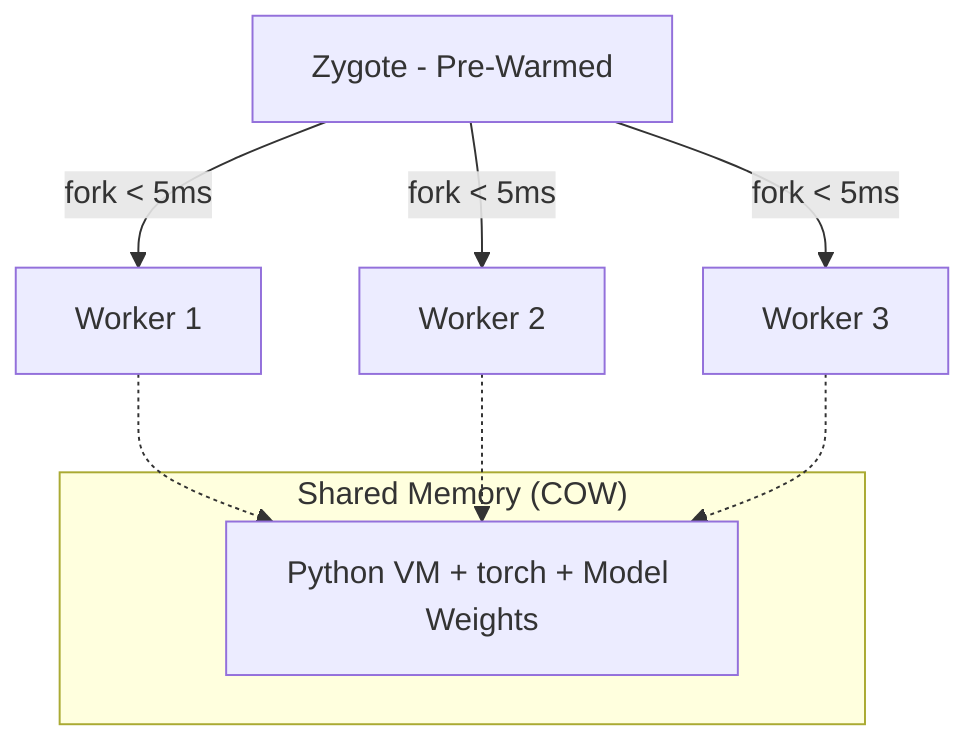

# Velo for AI Inference: Serverless Demo

> **Deploy AI models with <20ms cold start. Run 100 workers with the memory cost of 1.**

This demo proves how **Velo** eliminates the catastrophic cold starts and memory sprawl inherent in Python AI services (PyTorch, NumPy, Transformers).

---

## 🚀 The Proof (In 5 Minutes)

If you’ve built AI services in Python, you know the pain:
- Cold starts take **3,000ms+** for PyTorch imports.
- Memory usage explodes with every worker.
- Scaling hurts, and Docker often adds even more overhead.

Velo fundamentally changes this by using **Iron Zygote** and **Native Library Preloading (RFC-0035)**.

### Performance Benchmark

| Runtime | PyTorch Cold Start | Memory (8 workers) |
|:--------|:-------------------|:-------------------|
| Native Python | ~3,200ms | 16 GB |
| Docker | ~4,500ms | 18 GB |
| **Velo** | **<50ms** | **2.5 GB** ⚡ |

---

## 🛠️ The Velo Solution: Zygote Pre-Warming



*   **Copy-on-Write Memory**: Workers share the parent's memory pages until they modify them.
*   **Native Preloading**: Velo loads `.so` files (like `libtorch.so`) into the Zygote *before* forking, ensuring 100% relocation sharing.

---

## 🏃 Quick Start

### 1. Initialize the Environment
Generate the `preload.lock` to verify and pre-warm native libraries.

```bash
velo preload analyze
```

### 2. Run the Comparison
The `measure.sh` script runs the same Flask application under three different runtimes (Python, Docker, Velo) and reports the metrics.

```bash
bash scripts/measure.sh
```

---

## 📂 Project Structure

- `app.py`: Simple Flask service with an `/embed` endpoint.
- `model.py`: Simulates AI model initialization (hardened for real lib support).
- `pyproject.toml`: Velo configuration for `native_preload`.
- `scripts/measure.sh`: Automated benchmarking script.

---

## 🏛️ Learn More

- [Velo Core Repository](https://github.com/velo-sh/velo)
- [RFC-0035: Native Library Preload](https://github.com/velo-sh/velo/blob/main/docs/rfcs/0035-native-library-preload.md)

> Python is perfect for coding.
> **Velo** is perfect for running.
